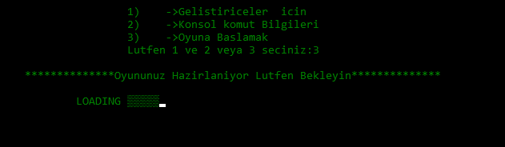
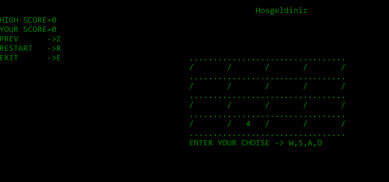

# C-ile-2048-Oyunu
Üniversitede arkadaşlarla beraber yaptığımız 2048 oyunu
Tanım

2048 oyunu tek oyunculu çevrimiçi bir sayı oyunudur. Amaç ekrandaki 16 karede yer alan rakamları birbirleriyle birleştirerek 2048 rakamına ulaşmaktır. Aynı değere sahip iki sayı üst üste gelirse birleşerek iki katı değerdeki bir rakama dönüşürler. Örnek olarak 2+2=4 toplama işlemini yaparak 2048 sayısına ulaşılmaya çalışılıyor.16 karenin hepsi dolmuş ve yan yana aynı sayılar gelmiyorsa oyun kaybedilmektedir.

Oyunun Açıklamaları

Oyunun Arayüzü
Oyunun arayüzünün en üstünde Hoşgeldiniz yazısı var. Oyunun arayüzünde 16 tane kare vardır. Bu karelerin içi çift sayılardan oluşuyor. Sol üst köşede sabit high score (yüksek skor) ve puan kazandıkça degişen your score (senin skorun) yazıları var. Hemen altında hareketi bir adım geri almak için Prev – Z  komutu yerleştirildi. Onun altında da oyunu tekrar başlatmak için Restart – R komutu var. En alt tarafta hareket komutları olan ↑W (yukarı) ←A (sol) ←D (sağ) ↓S (alt) komutları yerleştirilmiştir. 

Oyun mantığı

Oyun nasıl oynanır?
   Oyunumuz 4x4’lük satır ve sütunlardan oluşan konsollarla oynanan bir oyundur.
   Konsol Komutlar:
   Yukarı-> w
   Aşağı-> s
   Sola-> a
   Sağa-> d
Konsol komutlarıyla hareket ederek aynı olan rakamlar toplanır.
Hareket sonucu üst üste gelen iki aynı olan sayı, toplanarak ve toplanan sayı yeni bir değere dönüştürülür.
İki sayıyı toplayabilmemiz için iki sayınında değeri aynı olması gerekir.

Oyunun içindeki hareketleri geri alma komutu 
Z konsol komutuyla en fazla 3 defa adım geriye alınarak değer azaltılır. Atılan her geriye adım komutunda bir adım önceki toplanan puanlar silinir.

Oyunu sıfırlama (Restart) komutu
Oyuna takılı kaldığımızda veya oyuna tekrardan başlamak istediğimizde restart komutu için R tuşunu kullanırız.

Oyundan çıkış komutu
Oyundan çıkmak için -> e komutunu kullanırız.

Oyun skoru
Konsol tuşlarıyla sola ,sağa ,aşağı ,yukarı hareket ettirerek iki sayıyı oyun skoru elde ediyoruz.

Game over

4x4’lük satır ve sütun dolunca oyun biter. Oyun bittikten sonra(Game Over) ekrana oyunun tekrar başlatılması için ekrana bildiri gelir ve tekrar başlatılması için -> y komutu kullanılır. Oyundan çıkmak için -> n komutu kullanılır.

                         	
